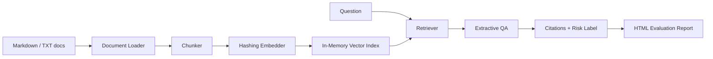

# RAG Doctor

Diagnose why a RAG application fails: retrieval misses, weak context, citation gaps, and hallucination risk.

This repository is intentionally small and readable. The first version uses a dependency-free hashing embedder so you can learn the full RAG pipeline before replacing pieces with FAISS, Chroma, bge, sentence-transformers, or OpenAI embeddings.

## What It Does

- Loads local `.md` and `.txt` files.
- Splits documents into overlapping chunks.
- Builds a small local vector index.
- Retrieves top-k context for a question.
- Produces an extractive answer with citations.
- Labels answer risk as `good`, `weak_context`, `possible_hallucination`, or `no_context`.
- Generates an HTML evaluation report from a question set.

## Quickstart

Run without installation:

```powershell
$env:PYTHONPATH="src"
python -m rag_doctor.cli index examples/sample_docs
python -m rag_doctor.cli ask "What does RAG Doctor evaluate?"
python -m rag_doctor.cli eval examples/sample_questions.json --output reports/report.html
```

Or install locally:

```powershell
python -m pip install -e .
rag-doctor index examples/sample_docs
rag-doctor ask "RAG Doctor 可以帮助定位什么问题？"
rag-doctor eval examples/sample_questions.json --output reports/report.html
```

## Architecture



## Project Layout

```text
rag-doctor/
  src/rag_doctor/
    load_documents.py  # read local .md/.txt documents
    chunker.py         # split documents into overlapping chunks
    embedder.py        # dependency-free tokenization and vectors
    retriever.py       # cosine search over chunk vectors
    qa.py              # extract grounded answers with citations
    evaluate.py        # score question sets and write HTML reports
    cli.py             # command line interface
  examples/
    sample_docs/
    sample_questions.json
  docs/
    learning-04-27.md
  tests/
```

## Why This Is Useful For Job Search

This project gives you concrete material to discuss in NLP, AI application, and LLM engineering interviews:

- How chunk size and overlap affect retrieval.
- Why embedding quality matters.
- How vector search works at a high level.
- How to ground answers in citations.
- How to evaluate RAG beyond "it looks right".
- How to build a clean Python package with a CLI and tests.

## Roadmap

- Add PDF support with `pypdf`.
- Add FAISS and Chroma index backends.
- Add bge-m3 or sentence-transformers embeddings.
- Add reranking.
- Add Streamlit or Gradio UI.
- Add MCP server mode for coding assistants.
- Add larger Chinese RAG benchmark examples.

## Topics For GitHub

`rag`, `llm`, `nlp`, `ai-agent`, `evaluation`, `retrieval-augmented-generation`, `vector-search`, `python`
